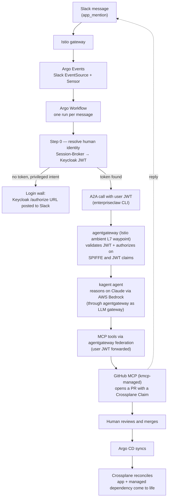

# EnterpriseClaw

**Build your company's AI assistant *inside* the guardrails your enterprise already trusts.**

EnterpriseClaw stands up a security-hardened AI-assistant control plane on Kubernetes. Your team talks to it from **Slack**; every privileged thing it does flows through **Argo Events → Argo Workflows → a pull request → Argo CD → Crossplane** — the same governed, auditable GitOps pipeline a regulated enterprise already runs. It is based on [OpenClaw](https://openclaw.ai/)'s AI assistant and built for heavily regulated environments.

The one-sentence thesis:

> **AI proposes; a governed, auditable GitOps pipeline disposes.** The agent can *reason* about what to build, but the **security boundary is the service mesh — never the model.** A prompt-injected agent still cannot reach any tool its identity is not allow-listed for.

This architecture is the subject of the ArgoCon Japan 2026 talk **"Teaching Argo to Talk: An Event-Driven Gateway for AI Agent Orchestration"** (July 28, 2026 — recording/slides link will land here once public).

## How it works

A platform engineer asks in Slack for a new service plus a managed dependency. One short-lived Argo Workflow runs *per message*, resolves the human's real corporate identity, and lets an agent reason — but the only way anything gets created is a pull request a human merges:



> **What runs today:** everything through triage, the read-only answer path, and the Keycloak login wall is **live**; the PR-opening action path is wired pending final secret provisioning, and Crossplane reconciliation is in flight. The [project status ledger](docs/docs/status.mdx) is the honest per-capability source of truth.

Three ideas the design hangs on:

1. **Two identity rails, enforced at the mesh.** *User* identity (a Keycloak JWT, brokered from Slack by [Session-Broker](https://github.com/jdarguello/Session-Broker)) rides alongside *workload* identity (Istio ambient SPIFFE/mTLS). ztunnel enforces L4; agentgateway validates the JWT at L7 and authorizes on *who **and** what*. Keycloak claims decide which agents, MCP servers, and tools a human may reach — translated into enforcement by the mesh, not by the LLM.
2. **The model is not the security boundary.** The unauthenticated path reaches only a toolless triage agent and a physically `--read-only` MCP server. Even a fully prompt-injected agent cannot call a tool its identity isn't allow-listed for.
3. **AI proposes, GitOps disposes.** Every order becomes an Argo Workflow run, a PR, and git history — a complete audit trail with no bolted-on tooling.

## What's in the box

| Layer | What it does |
|---|---|
| **CLI** (`enterpriseclaw`) | A [Nushell](https://www.nushell.sh/) CLI run inside [Devbox](https://www.jetify.com/devbox). `enterpriseclaw init` goes from zero to a running platform; `enterpriseclaw destroy` tears it down (ideal for ephemeral environments). |
| **IaC** ([infrastructure/aws/](infrastructure/aws/)) | [OpenTofu](https://opentofu.org/) modules for VPC, EKS, Route53/ACM, ECR, S3, and Secrets Manager. tfvars are generated from your `.env` — never hand-edited. |
| **GitOps toolkit** ([gitops/](gitops/)) | An Argo CD app-of-apps. This public repo is the framework; your *private* config repo overlays it per-tenant (Helm `$values` + Kustomize patches) and is patched by the CLI with live infra outputs. |
| **Agentic platform** ([gitops/agentic/](gitops/agentic/)) | The **kagent trio** — [kagent](https://kagent.dev/) (agent runtime), [kmcp](https://github.com/kagent-dev/kmcp) (runs MCP servers on-cluster), [agentgateway](https://agentgateway.dev/) (L7 data plane: A2A routing, MCP federation, JWT authz) — on **Istio ambient**. |
| **Identity** ([Session-Broker](https://github.com/jdarguello/Session-Broker)) | Separate repo. Binds a Slack user to a real corporate identity (Keycloak, federated to Google Workspace) so privileged actions carry a *human* identity, not a static bot token. |

## Quick start

> **Heads-up:** the install path is being streamlined ([#17](https://github.com/jdarguello/EnterpriseClaw/issues/17)). Today you clone the repo and provide your own `.env`; a packaged install is coming.

### Prerequisites

- An **AWS account** with an IAM identity able to run the OpenTofu apply (VPC/EKS/Route53/ECR/S3, plus Secrets Manager **write** — the platform auto-creates its internal secret).
- A **Route53 hosted zone** for your domain.
- A **GitHub App** (for the platform's git automation) and a **private GitOps config repo** the CLI can clone and push to.
- A **Slack app** for your workspace (the front door) and **AWS Bedrock model access** enabled for the Claude model (the reasoning engine).
- A few Secrets Manager entries created ahead of time — see the [install reference](docs/docs/install.mdx) for the exact names and key shapes (`github-creds`, `webhook-creds`, `slack-creds`, `google-idp`, `github-readonly-token`).
- [Devbox](https://www.jetify.com/devbox) installed locally. Devbox pins everything else (Nushell, OpenTofu, kubectl, Helm, Argo CLI, AWS CLI, gh, …).

`enterpriseclaw init` installs the whole platform, including the agentic stack and the Session-Broker identity layer — you don't deploy those separately.

### Run it

```bash
git clone https://github.com/jdarguello/EnterpriseClaw.git
cd EnterpriseClaw/cli

# Create cli/.env with your values (names below, values are yours)

devbox shell          # pins the toolchain and drops you into Nushell
enterpriseclaw -h     # list commands
enterpriseclaw init   # zero → running platform (OpenTofu → EKS → Argo CD app-of-apps)
enterpriseclaw destroy  # full teardown
```

`enterpriseclaw init` accepts `--cloud-provider`, `--cluster-name`, `--secret-provider`, `--git-provider`, `--persistant-state`, `--gitops-agent`, `--gitops-setup` — the AWS + GitHub + Argo CD + `push` combination is the tested path (see the [project status ledger](docs/docs/status.mdx) for what's built vs. in flight vs. aspirational — no overclaiming).

### Required `.env` keys (names only — bring your own values)

`region` · `COMPANY_NAME` · `ORG_NAME` · `CONFIG_REPO` · `BRANCH_NAME` · `domain_name` · `argocd_version` · `GIT_USER` · `GIT_USER_EMAIL` · `GH_TOKEN` · `GITHUB_APP_CLIENT_ID` · `GITHUB_APP_CLIENT_SECRET` · `github_app_registry` · `github_webhook_registry` · `AWS_ACCESS_KEY_ID` · `AWS_SECRET_ACCESS_KEY`

**Never commit `.env`** — it is gitignored, and no secret *values* appear anywhere in this repo or its docs.

## Documentation

The full docs live under [docs/](docs/) (Docusaurus):

- **[Architecture](docs/docs/architecture.mdx)** — the spine, the two identity rails, and the trust boundaries.
- **[Demo walkthrough](docs/docs/demo-walkthrough.mdx)** — the Golden-Path-via-chat scenario, step by step.
- **[Install & configuration reference](docs/docs/install.mdx)** — prerequisites, `.env` keys, CLI flags, teardown.
- **[Project status](docs/docs/status.mdx)** — the honest built / in-flight / aspirational ledger.

```bash
cd docs && npm install && npm start   # local docs site
```
