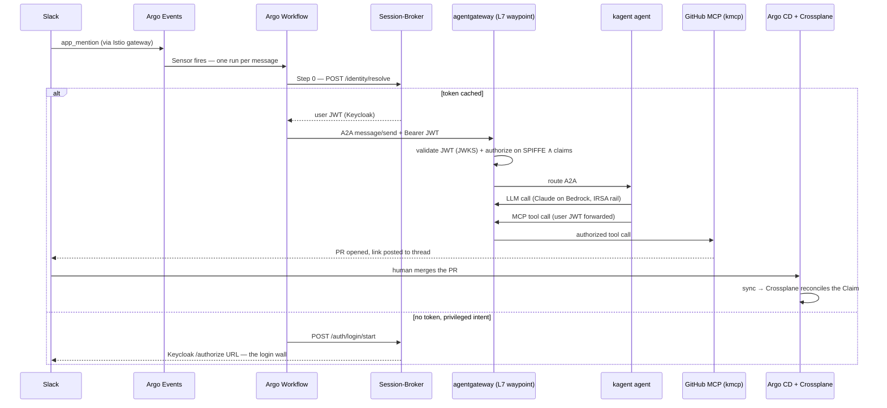

# Architecture

EnterpriseClaw turns a chat message into a **governed AI agent workflow**. It is not a chatbot: it is an event-driven gateway in which Argo Events listens, Argo Workflows orchestrates, an agent reasons, and every privileged change lands as a **pull request** that Argo CD and Crossplane reconcile into real infrastructure.

The design rule that everything below follows:

> **The model is not the security boundary — the mesh is.** Which agents, MCP servers, and tools any identity can reach is decided by workload SPIFFE (ztunnel, L4) and Keycloak JWT claims (agentgateway, L7) — never by the LLM's reasoning.

## The layers

| Layer | Components | Role |
|---|---|---|
| Substrate | AWS EKS, VPC, Route53/ACM, ECR, S3, Secrets Manager (OpenTofu) | The cloud footprint, provisioned by `enterpriseclaw init` |
| GitOps | Argo CD (app-of-apps), External-Secrets | Declares and reconciles everything above the substrate |
| Eventing | Istio gateway, Argo Events (EventSource + Sensor), NATS EventBus, Argo Workflows | Turns each inbound chat message into one short-lived workflow run |
| Mesh | Istio **ambient**: ztunnel (L4 mTLS/SPIFFE) + **agentgateway** as the L7 waypoint | The enforcement plane for both identity rails |
| Agentic | The **kagent trio**: kagent (agent runtime) · kmcp (runs MCP servers on-cluster) · agentgateway (A2A routing, MCP federation, JWT authz) | Where the agent reasons and calls tools |
| Identity | [Session-Broker](https://github.com/jdarguello/Session-Broker) + Keycloak (Google-federated), Redis via Dapr | Binds a Slack user to a real corporate identity |
| Delivery | GitHub PR → Argo CD → Crossplane | The only path by which anything gets created |

## The spine

One workflow run per inbound Slack message — compute is stateless, and conversation state lives in the Slack thread itself (rebuilt each turn from `conversations.replies`):

### The Argo primitives doing the work

- **Sensor dependency logic** parses and validates intent: the `slack-mention` Sensor filters on `type == app_mention` and extracts `text` / `user` / `channel` / `ts` / `thread_ts` before any compute spins up.
- **Workflow DAGs** branch deterministically on the agent's structured output (`question` / `proposal` / `login-required`) — triage → read *or* resolve → login *or* act — with retry semantics on the flaky hops and an `onExit` handler that reports failures back to the thread.
- **Parameter propagation** carries the authenticated identity: Step 0 resolves the human's Keycloak JWT, and workflow parameters carry it into the A2A call so the *user* identity crosses every step it is entitled to cross.
- **The native audit trail**: every order is an Argo Workflow run (the Workflow Archive plus prompt/response artifacts on S3 is in flight — see [status](#status-map)), plus the PR and git history. No bolted-on audit tooling.

## The two identity rails

The demo's headline. Two identities ride every privileged request, and they are enforced at different layers:

| Rail | Identity | Minted by | Enforced by |
|---|---|---|---|
| **User** | Keycloak JWT (claims: roles/groups/scopes) | Session-Broker OAuth flow (Google-federated Keycloak) | **agentgateway** at L7 — signature (JWKS), issuer, audience, then claim-gated per route |
| **Workload** | SPIFFE/mTLS principal | Istio ambient (ztunnel) | **ztunnel** at L4; agentgateway also matches `source.principal` |

Keycloak *authors* the authorization model — the JWT's claims say which agents/MCPs/tools this human may reach — and the mesh *translates it into enforcement*. The LLM never gets a vote.

Two deliberate boundaries on the user JWT:

- **The LLM hop is not user-authenticated.** kagent calls Claude on AWS Bedrock *through agentgateway as the LLM gateway*; only agentgateway's ServiceAccount holds the Bedrock IRSA role (least privilege). That hop rides the workload rail.
- **The JWT stops at the GitHub MCP.** GitHub-side authentication uses GitHub App credentials, so the commit author is the bot; *human* attribution lives in the Argo Workflow run and the agentgateway trace. (Full user impersonation on GitHub is a hardening item, post-demo.)

## The unauthenticated door

The login wall is conditional on **intent**, not mere auth state — and it is what makes the "prompt-injected agent still can't act" claim concrete:

1. A message with no cached token first reaches a **toolless triage agent** (`general-classifier`). Its SPIFFE principal is in no MCP's allow-list: even fully prompt-injected, it cannot reach a tool. It only classifies intent.
2. **Informational intent** routes to a read-only reader (`github-reader`) whose *sole* tool is a physically `--read-only` GitHub issues MCP — zero write tools are registered. That read-scoped token is the entire anonymous blast radius.
3. **Privileged intent** hits the wall: the workflow asks Session-Broker to start a login, posts the Keycloak `/authorize` URL to the thread, and ends. The user's next reply fires a fresh workflow, now with a token.

## Public / private repo split

This public repo is the **framework**: reusable GitOps definitions, the CLI, the OpenTofu modules, the agent/MCP/gateway catalog. Each installation has a **private config repo** — the Argo CD app-of-apps root — that remote-references the public repo and overlays it with tenant values (Helm multi-source `$values`, Kustomize patches). The CLI's real job is generating those overlays from live infra outputs. Secrets never live in either repo: they resolve at runtime via External-Secrets from AWS Secrets Manager.

Identity is a third repo: [Session-Broker](https://github.com/jdarguello/Session-Broker) owns Keycloak, Redis, Dapr, and the OAuth paths. EnterpriseClaw only *consumes* it (Step 0, the login wall) and provisions the secrets its charts need.

:::warning Sandbox values
Tenant identifiers visible in this public repo (org names, domains) are **throwaway sandbox values**, not live configuration or secrets. Parameterizing them out of the framework is tracked in [issue #15](https://github.com/jdarguello/EnterpriseClaw/issues/15).
:::

## Status map

Honesty over polish — the full ledger lives on the [project status page](./status.mdx). In short: the platform substrate, the GitOps tree, both inbound doors (GitHub push + Slack), the identity Step 0 / login wall, and the read-only agent path are **live**; the JWT-bearing action path is wired end-to-end pending one secret; Crossplane, the Workflow Archive/S3 artifacts, and Kyverno are **in flight**; multi-cloud and Teams are **aspirational**.
